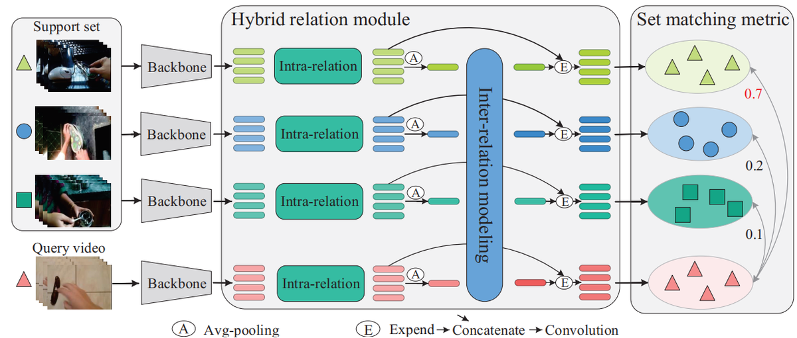

# Hybrid Relation Guided Set Matching for Few-shot Action Recognition (CVPR-2022)
### Official Pytorch Implementation of '[HyRSM](https://openaccess.thecvf.com/content/CVPR2022/papers/Wang_Hybrid_Relation_Guided_Set_Matching_for_Few-Shot_Action_Recognition_CVPR_2022_paper.pdf)'


> **Hybrid Relation Guided Set Matching for Few-shot Action Recognition**<br>
> Xiang Wang,  Shiwei Zhang,  Zhiwu Qing,  Mingqian Tang,  Zhengrong Zuo,  Changxin Gao,  Rong Jin, and Nong Sang

> [Paper](https://openaccess.thecvf.com/content/CVPR2022/papers/Wang_Hybrid_Relation_Guided_Set_Matching_for_Few-Shot_Action_Recognition_CVPR_2022_paper.pdf), [Project](https://hyrsm-cvpr2022.github.io/)
>
> **Abstract:** *Current few-shot action recognition methods reach impressive performance by learning discriminative features for each video via episodic training and designing various temporal alignment strategies. Nevertheless, they are limited in that (a) learning individual features without considering the entire task may lose the most relevant information in the current episode, and (b) these alignment strategies may fail in misaligned instances. To overcome the two limitations, we propose a novel Hybrid Relation guided Set Matching (HyRSM) approach that incorporates two key components: hybrid relation module and set matching metric. The purpose of the hybrid relation module is to learn task-specific embeddings by fully exploiting associated relations within and cross videos in an episode. Built upon the task-specific features, we reformulate distance measure between query and support videos as a set matching problem and further design a bidirectional Mean Hausdorff Metric to improve the resilience to misaligned instances. By this means, the proposed HyRSM can be highly informative and flexible to predict query categories under the few-shot settings. We evaluate HyRSM on six challenging benchmarks, and the experimental results show its superiority over the state-of-the-art methods by a convincing margin.*


This code is based on [pytorch-video-understanding](https://github.com/alibaba-mmai-research/TAdaConv) codebase, which provides a comprehensive video understanding solution for video classification and temporal detection. 

## Installation

Requirements:
- Python>=3.6
- torch>=1.5
- torchvision (version corresponding with torch)
- simplejson==3.11.1
- decord>=0.6.0
- pyyaml
- einops
- oss2
- psutil
- tqdm
- pandas

optional requirements
- fvcore (for flops calculation)

Or you can create environments with the following command:
```
conda env create -f environment.yaml
```

## Data preparation

First, you need to download the datasets from their original source (If you have already downloaded, please ignore this step
):

- [SSV2](https://20bn.com/datasets/something-something#download)
- [Kinetics](https://github.com/Showmax/kinetics-downloader)
- [UCF101](https://www.crcv.ucf.edu/data/UCF101.php)
- [HMDB51](https://serre-lab.clps.brown.edu/resource/hmdb-a-large-human-motion-database/#Downloads)
- [Epic-kitchens](https://epic-kitchens.github.io/2022)

Then, prepare data according to the [splits](configs/projects/hyrsm) we provide.

## Running
The entry file for all the runs are `runs/run.py`. 

Before running, some settings need to be configured in the config file. 
The codebase is designed to be experiment friendly for rapid development of new models and representation learning approaches, in that the config files are designed in a hierarchical way.

For an example run, open `configs/projects/hyrsm/kinetics100/HyRSM_K100_1shot_v1.yaml`

A. Set `DATA.DATA_ROOT_DIR` and `DATA.DATA_ANNO_DIR` to point to the kinetics dataset, 

B. Set the valid gpu number `NUM_GPUS`

Then the codebase can be run by:
```
python runs/run.py --cfg configs/projects/hyrsm/kinetics100/HyRSM_K100_1shot_v1.yaml
```

## Citation
If you find this code useful, please cite our paper.

~~~~
@inproceedings{wang2022hybrid,
  title={Hybrid Relation Guided Set Matching for Few-shot Action Recognition},
  author={Wang, Xiang and Zhang, Shiwei and Qing, Zhiwu and Tang, Mingqian and Zuo, Zhengrong and Gao, Changxin and Jin, Rong and Sang, Nong},
  booktitle={Proceedings of the IEEE/CVF Conference on Computer Vision and Pattern Recognition},
  pages={19948--19957},
  year={2022}
}
~~~~
